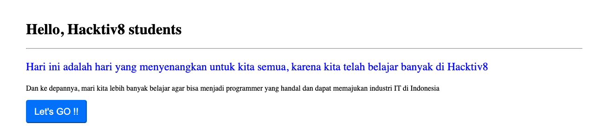

# Simulasi-Live-Code-3-Phase-0

## RULES

1. Kerjakan secara individu. Segala bentuk kecurangan (mencontek ataupun diskusi) akan menyebabkan skor simulasi live code ini 0.
1. Clone repo ini kemudian buatlah **branch dengan nomor yang diinformasikan oleh buddy kalian**.
1. Kerjakan pada file JavaScript (*.js) dan HTML (*.html) yang telah disediakan.
1. Waktu pengerjaan:
   - **90 menit** untuk **5 soal**.
1. **Pada text editor hanya ada file yang terdapat pada repository ini**.
1. Membuka referensi eksternal seperti Google, MDN, w3school, dan StackOverflow diperbolehkan.
1. Dilarang membuka repository di organisasi tugas, baik pada organisasi batch sendiri ataupun batch lain, baik branch sendiri maupun branch orang lain (**setelah melakukan clone, close tab GitHub pada web browser kalian**).
1. Lakukan `git push origin <branch-name>` dan create pull request **hanya jika waktu Live Code telah usai (bukan ketika kalian sudah selesai mengerjakan)**. Tuliskan nama lengkap kalian saat membuat pull request dan assign buddy.
1. **Penilaian berbasis logika dan hasil akhir**. Pastikan keduanya sudah benar.
1. Untuk soal no 5, silakan perhatikan gambar di bawah ini sebagai acuan

## Notes

- Live code ini memiliki testing. Pastikan telah mengeksekusi command `npm install` sebelum melakukan test. Command line untuk test adalah `npm test -- <nama_file>`.

  | Soal | Command            | Max Score |
  | ---- | ------------------ | --------- |
  | 1    | `npm test -- 1.js` | 100       |
  | 2    | `npm test -- 2.js` | 100       |
  | 3    | `npm test -- 3.js` | 100       |
  | 4    | `npm test -- 4.js` | 100       |
  | 5    | test di browser, tidak ada npm test nya    | 100       |

- Built-in functions yang tidak dilarang oleh RULES:
  - Basic primitive data types: `Number()`, `String()`, `Boolean()`
  - Informatives: `typeof`, `.length`, `isInteger()`, `isArray()`, `isNaN()`
  - Maths: `Math.floor()`, `Math.round()`, `Math.ceil()`, `Math.abs()`, `Math.sqrt()`, `Math.random()`
  - Strings: `toString()`, `toUpperCase()`, `toLowerCase()`, `parseInt()`
  - Object: `Object.keys()`, `Object.values()`
  - Array: `push()`
- Jangan lupa untuk menyertakan pseudocode apabila diminta oleh soal. Apabila **pseudocode tidak disertakan**, mengakibatkan **nilai 0** untuk soal tersebut.
